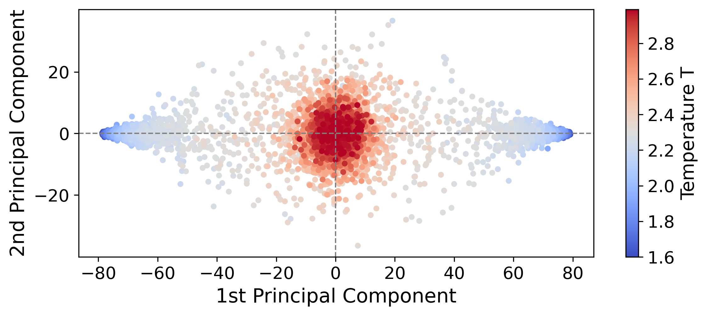
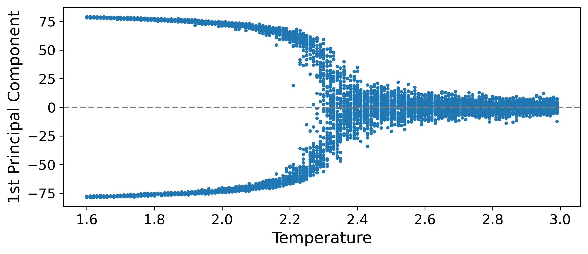

Principal component analysis (PCA)
-----------------

The process of PCA involves data standardization, resulting in the matrix $\textbf{Z} = \textbf{X} - \bar{\textbf{X}}$, where $\bar{\textbf{X}}$ denotes the mean matrix. Next, we perform eigenvalue decomposition on the covariance matrix $\textbf{C} = \frac{1}{\mathfrak{M} - 1} \textbf{Z}^T \textbf{Z}$ to obtain eigenvalues $\lambda_i$ and their corresponding eigenvectors $\omega_i$ by solving the equation $\textbf{C} \, \omega_i = \lambda_i \, \omega_i$. We then select the top $k$ largest eigenvectors to construct the matrix $\textbf{W}$, leading to the projection $\textbf{Y} = \textbf{Z} \textbf{W}$, where $\textbf{Y} \in \mathbb{R}^{\mathfrak{M} \times k}$. In this case, we set $k = 2$ to choose the two principal components with the largest eigenvalues, represented by the eigenvectors $y_1 = \textbf{Z} \, w_1$ and $y_2 = \textbf{Z} \, w_2$, respectively.

Ising Model
-----------------

The Hamiltonian of the Ising model without external field is given by:

$$
H = -J \sum_{\langle i, j \rangle} \sigma_i \sigma_j,
$$

where $\sigma_i = \pm 1$ denotes the spin at site $i$, $J > 0$ is the coupling constant, and the sum is taken over all nearest-neighbor pairs $\langle i, j \rangle$. The model is defined on a square lattice of size $L \times L$ with periodic boundary conditions. The total magnetization of the system is defined as $M = \sum_i \sigma_i$, and the average magnetization is calculated by $m = M/N$, where $N = L^2$ is the total number of sites. Both the mean and variance of $m$ serve as criteria for thermal equilibration during sampling.

Here, MCMC simulations were performed to generate the configurations of the Ising model. The lattice size was set to $L = 80$, and spin configurations were sampled at $n_{\text{temp}} = 140$ distinct temperatures in the range $T \in [1.6, 3.0)$, using a step size of $0.01$. For each temperature, $n_{\text{samp}}=80$ independent spin configurations were collected, each initialized from a random spin state from $\{-1, 1\}$. To efficiently mitigate critical slowing down, the Wolff cluster algorithm was adopted for spin updates.

At each temperature $T$, the simulation protocol consisted of system equilibration followed by statistically independent sampling. Equilibrium states were assessed using a dual sliding window approach: two consecutive windows of length $W = 100$ were monitored, and equilibrium was deemed reached when the difference in magnetization means was less than $\varepsilon_m = N \times 10^{-3}$ and the difference in variances was less than $\varepsilon_v = N^2 \times 10^{-4}$. After equilibration, the autocorrelation time $\tau$ of the magnetization time series was estimated, and the sampling interval was set to $\delta = \lceil 10 \times \tau \rceil$ to ensure statistical independence among configurations.

PCA on data matrix of Ising configurations
-----------------

All collected spin configurations were flattened into vectors of length $N$ and assembled into a data matrix $\mathbf{X} \in \mathbb{R}^{V \times N}$, where $V = n_\text{temp} \times n_{\text{samp}} = 11,200$ is the total number of samples. The matrix was subjected to PCA, from which the first principal component $y_1$ and the second principal component $y_2$ were extracted for further analysis. The scatter plot of $(y_1, y_2)$ for all samples, colored by $T$, is shown in the following figure. At low temperatures, the data points (shown in blue) are symmetrically distributed at both ends of the $y_1$ axis, corresponding to the two symmetry-broken ferromagnetic phases. At high temperatures, the data points (shown in red) cluster around the origin, indicating the disordered paramagnetic phase. Moreover, the data points near $T_c$ are scattered in the intermediate region. At low temperatures, the data points (shown in blue) are symmetrically distributed at both ends of the $y_1$ axis, corresponding to the two symmetry-broken ferromagnetic phases. At high temperatures, the data points (shown in red) cluster around the origin, indicating the disordered paramagnetic phase. Moreover, the data points near $T_c$ are scattered in the intermediate region.

In addition, the variation of the projection of each configuration onto the first principal component $y_1$ was examined as a function of $T$. As demonstrated in the following figure, plotting $y_1$ versus $T$ reveals a distinct bimodal distribution in the low-temperature regime, corresponding to the two symmetry-broken ferromagnetic phases (ordered), while at high temperatures, $y_1$ converges toward zero, indicating the paramagnetic phase (disordered). A pronounced transition in the distribution of $y_1$ is observed near the exact critical temperature $T_c = 2/\ln(1+\sqrt{2}) \approx 2.269$ proved by Onsager, clearly distinguishing the ordered and disordered phases of the Ising model.

